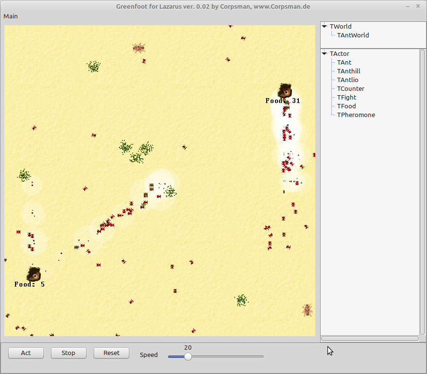

# Introduction
This Repository is a Lazarus reimplementation of the Java Greenfoot project from

https://www.greenfoot.org/door

Compileable under Windows or Linux

# Documentation
For Usage of the Greenfoot classes see the documentation of the Greenfoot project

# Content
The following classes are available
- TWorld
- TActor
- TGreenfootImage
- TRandomizer
- TMouseInfo

Additional there is a Graphikengine
- TGreenFootGraphicEngine

# The Source comes with the following samples
- Ants Advanced - a ant simulation
- Balloon - a balloon popping game
- Game of life - a game of live simulator
- Lunar lander - a space craft landing simulator
- Minesweeper - the implementation of the Windows Minesweeper game
- PrimeSnake - a Snake game that helps to learn prime numbers
- SpaceCommand - a Space invader game
- Tetris - the implementation of the classic Tetris game
- Wombat - try to eat leafs and dont get catched by the other wombats

